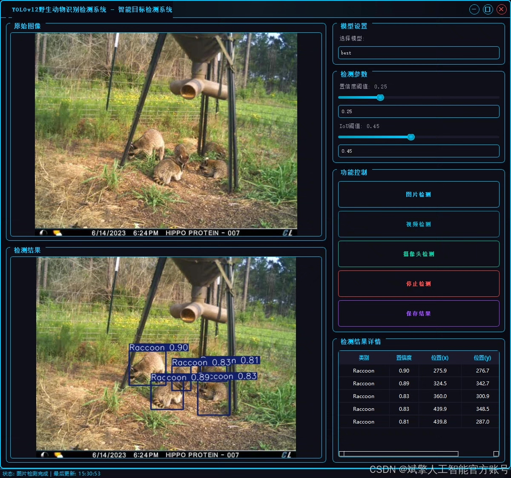
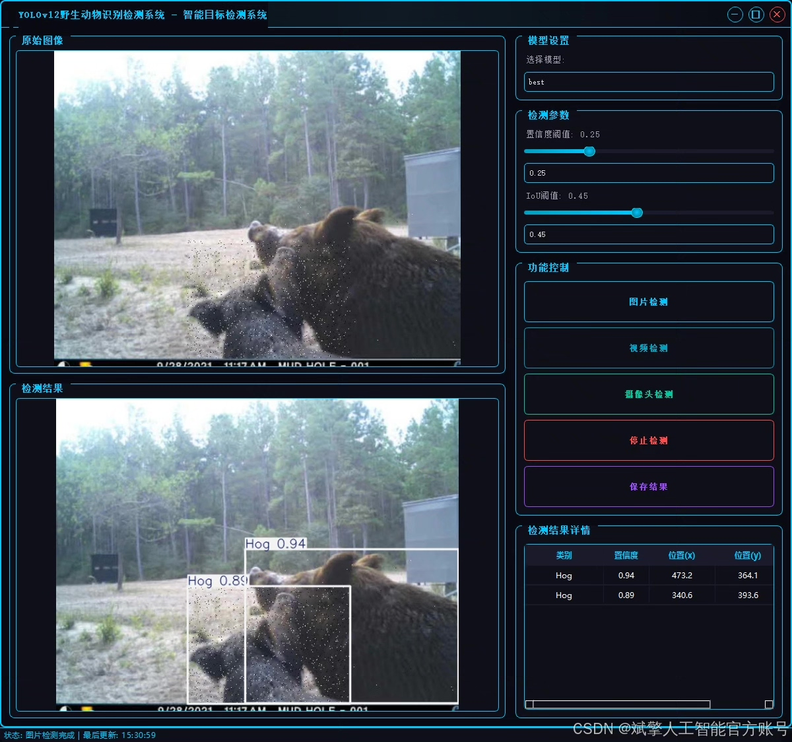
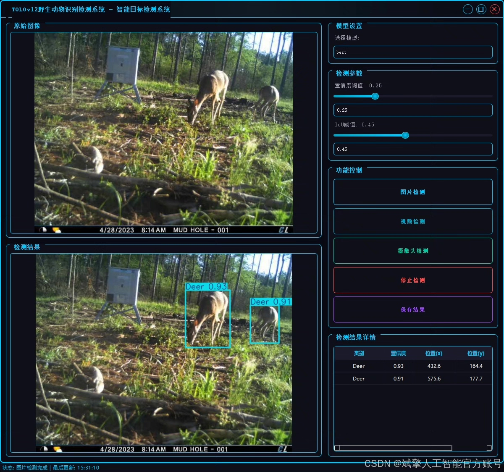
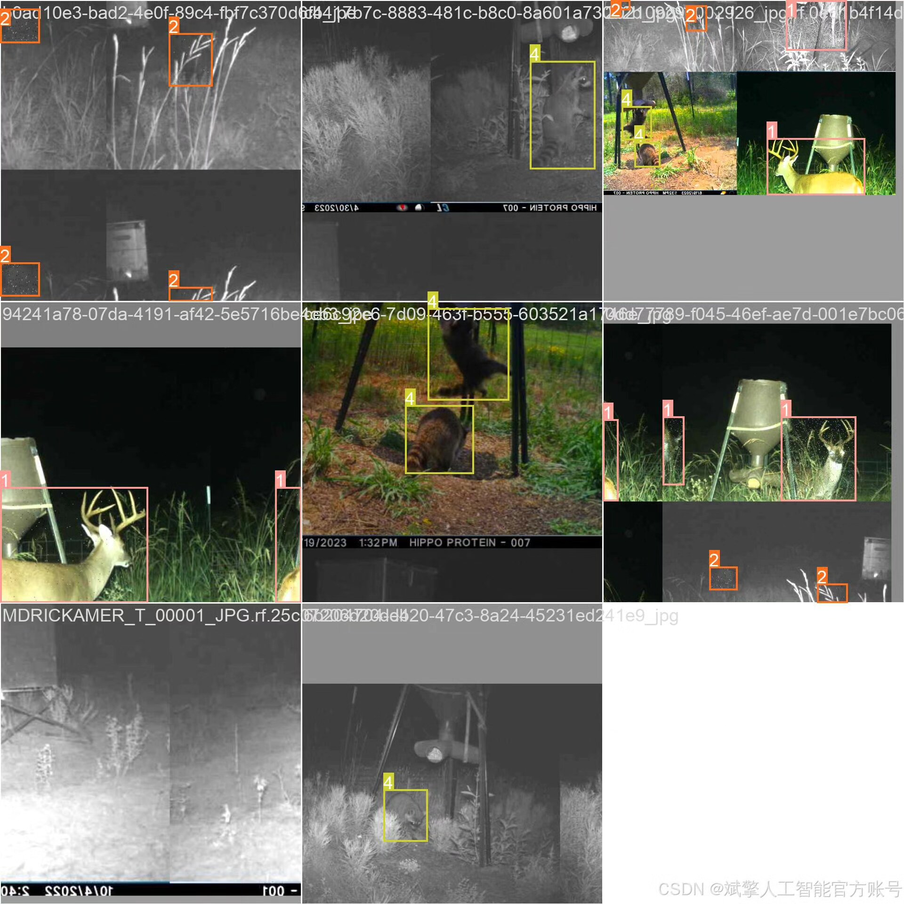
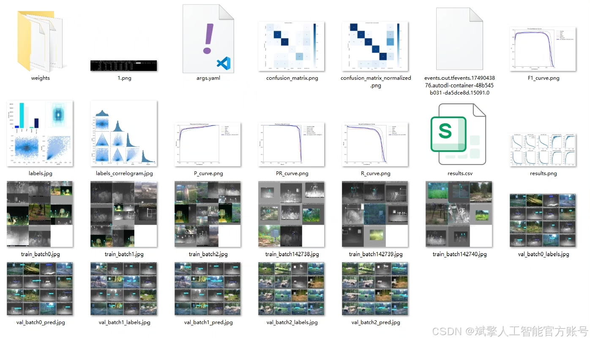
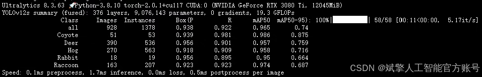
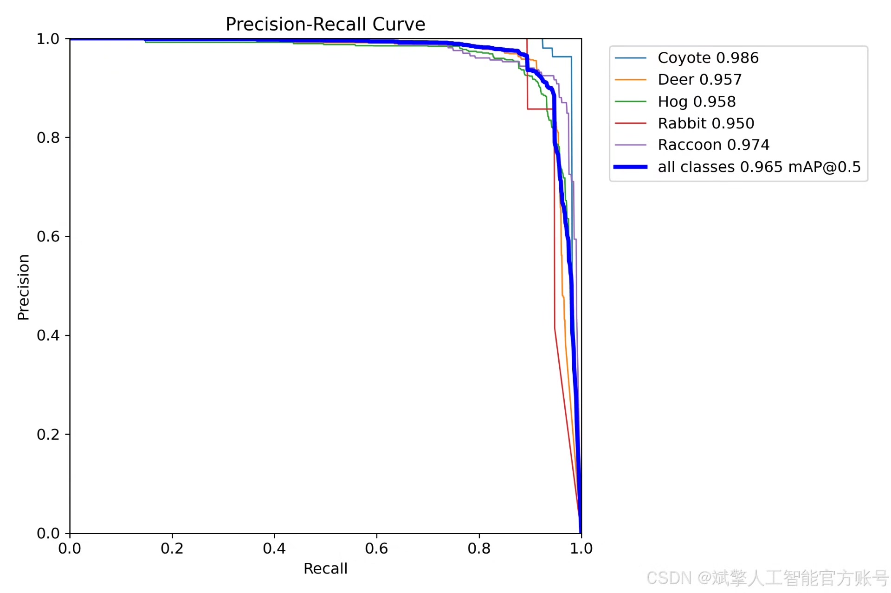
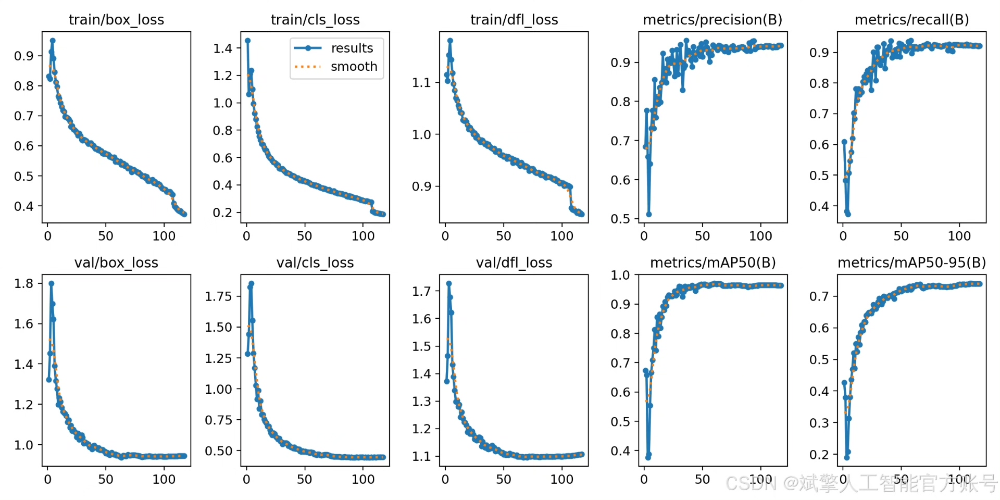
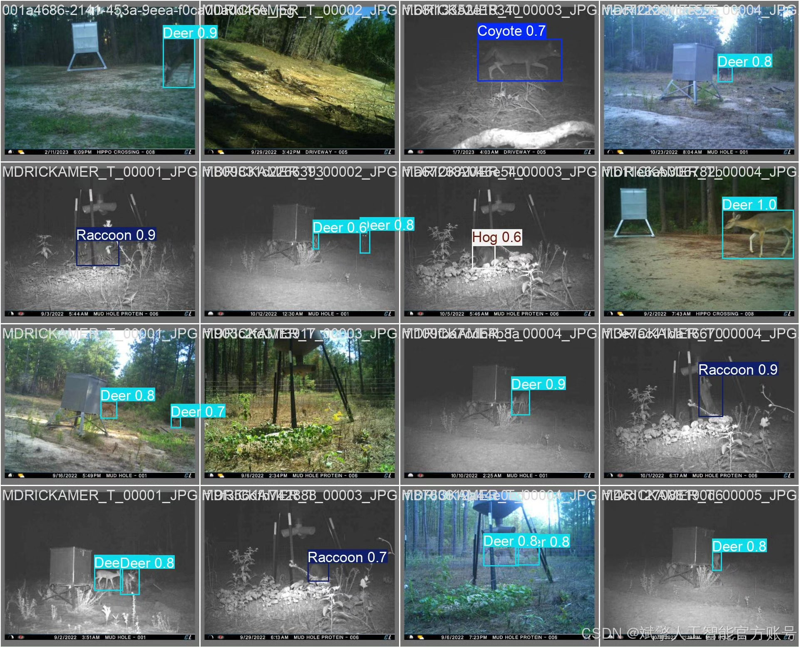

# YOLOv12 Wildlife Detection System

## Body

YOLOv12 Wildlife Detection System Based on Deep Learning YOLOv12: A Wildlife Recognition and Detection System (YOLOv12+YOLO dataset + UI interface + login registration interface + Python project source code + model)

This paper designs and implements a wildlife recognition and detection system based on the YOLOv12 deep learning algorithm, aiming to efficiently and accurately identify five common wild animals (Coyote, Deer, Hog, Rabbit, Raccoon). The system utilizes the YOLOv12 object detection model, combined with a custom dataset containing training sets (10,665 images), validation sets (928 images), and test sets (536 images) for training and evaluation. To enhance user experience, the system integrates a visual UI interface and supports login and registration functions. Experimental results show that the system exhibits high detection accuracy and real-time performance on the test set, which can be applied in ecological monitoring, wildlife protection, and agricultural and forestry safety fields. This paper elaborates on the system architecture, dataset construction, model optimization, and interface design, providing a reusable solution for similar target detection tasks.

✅ User Login and Registration: Supports password verification and security validation.
✅ Three Detection Modes: Based on the YOLOv12 model, supporting image, video, and real-time camera detection, with precise target recognition.
✅ Dual-Screen Comparison: Displays the original scene and detection results simultaneously on the screen.
✅ Data Visualization: Real-time table displaying the category, confidence, and coordinates of detected targets.
✅ Intelligent Parameter Tuning: Offers a confidence slide bar to dynamically optimize detection accuracy, adapting to different scene requirements.
✅ Sci-Fi Style Interactive Interface: Dark theme paired with dynamic light effects, reducing visual fatigue and enhancing operational experience.

## Images

## Payment

Here is a pay link on Stripe ( https://buy.stripe.com/3cs8yP7sY87d0vu9AB ). Please contact me lonlonago@foxmail.com after funding $89, and I will send you a complete data files , thank you!

